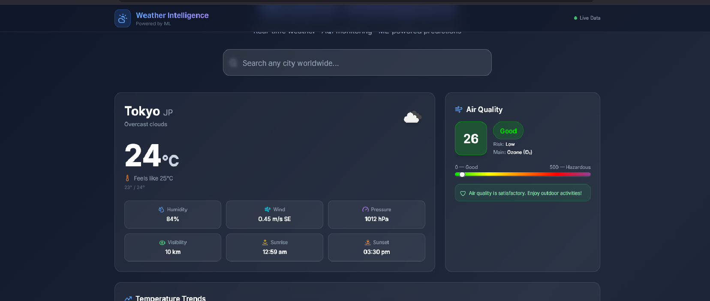
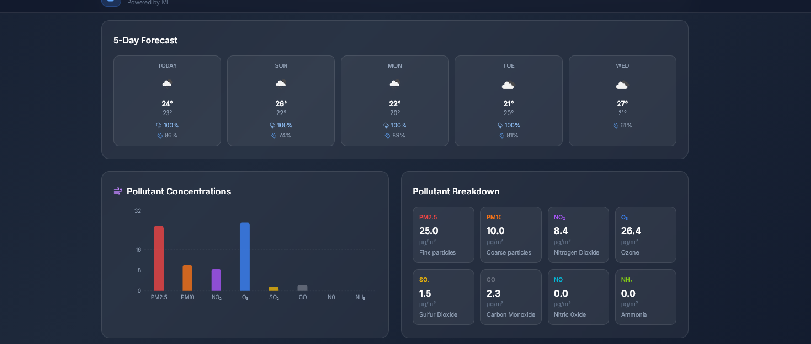
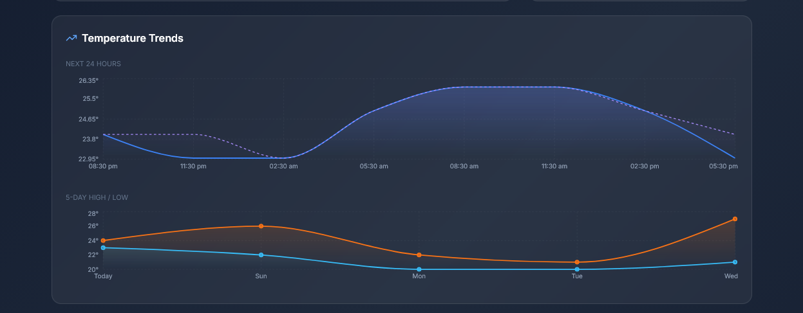
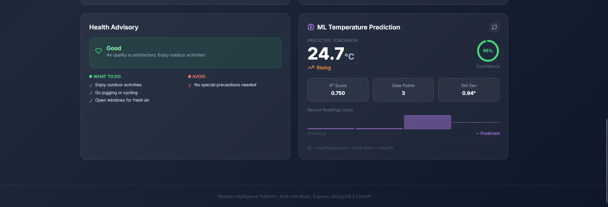

# 🌦 Weather Intelligence Platform

A **production-quality**, full-stack weather monitoring application featuring real-time weather data, AQI monitoring, pollutant analysis, and **ML-powered temperature predictions** built with a modern MERN + FastAPI architecture.

[](https://reactjs.org/)
[](https://vitejs.dev/)
[](https://expressjs.com/)
[](https://www.mongodb.com/)
[](https://fastapi.tiangolo.com/)
[](https://scikit-learn.org/)

---

## 📸 Application Preview

<p align="center">
  
</p>

---

## 📷 Screenshots

<table>
<tr>
<td align="center">

### 🌤 Dashboard


</td>

<td align="center">

### 📊 Weather Analytics



</td>
</tr>

<tr>
<td align="center">

### 📈 Temperature Trends



</td>

<td align="center">

### 🤖 ML Prediction



</td>
</tr>
</table>

---

## ✨ Features

| Feature | Details |
|---|---|
| 🌡 **Current Weather** | Temperature, feels-like, humidity, wind speed/direction, pressure, visibility |
| 📅 **5-Day Forecast** | Daily high/low, precipitation chance, weather icons |
| 💨 **Live AQI** | WAQI-sourced real-time AQI with colour-coded levels (Good → Hazardous) |
| 🧪 **Pollutant Breakdown** | PM2.5, PM10, NO₂, O₃, SO₂, CO, NO, NH₃ displayed as charts and grids |
| 🏥 **Health Advisory** | Level-appropriate Do/Don't tips + active pollution alerts |
| 📊 **Interactive Charts** | 24-hour temperature trend, 5-day high/low, pollutant bar chart (Recharts) |
| 🔍 **City Search** | Debounced autocomplete with recent search history (MongoDB) |
| 🤖 **ML Prediction** | Next-day temperature prediction using Linear Regression (FastAPI + scikit-learn) with confidence score, R² and trend |
| 🔄 **Graceful Fallbacks** | AQI fallback to nearest station; degrades gracefully without MongoDB |

---

## 🏗 Architecture

```
                     OpenWeatherMap API
                            │
                            ▼
React (Vite) ──► Express.js API ──► MongoDB Atlas
      │                │
      │                ▼
      │          FastAPI ML Service
      │          (scikit-learn)
      │
      ▼
   Interactive Dashboard
```

```
weather-intelligence/
├── client/          # React + Vite frontend (→ Vercel)
├── server/          # Express.js API        (→ Render)
└── ml-service/      # FastAPI ML service    (→ Render)
```

---

## 🚀 Quick Start

### Prerequisites
- Node.js 18+
- Python 3.11+
- MongoDB Atlas account (free tier works)
- OpenWeatherMap API key (free at [openweathermap.org](https://openweathermap.org/api))
- WAQI API token (free at [waqi.info](https://waqi.info/))

---

### 1. Clone & Setup

```bash
git clone https://github.com/hellykhadka7/IntelliWeather.git
cd IntelliWeather
```

---

### 2. ML Service

```bash
cd ml-service
pip install -r requirements.txt
cp .env.example .env
python main.py        # Runs on http://localhost:8000
```

Verify: `http://localhost:8000/health` → `{"status":"ok"}`

---

### 3. Express Backend

```bash
cd server
npm install
cp .env.example .env
```

Edit `server/.env`:
```env
PORT=5000
MONGODB_URI=<your_mongodb_uri>
OPENWEATHER_API_KEY=<your_api_key>
WAQI_API_TOKEN=<your_token>
ML_SERVICE_URL=http://localhost:8000
CORS_ORIGIN=http://localhost:5173
```

```bash
npm run dev           # Runs on http://localhost:5000
```

Verify: `http://localhost:5000/health` → `{"status":"ok"}`

---

### 4. React Frontend

```bash
cd client
npm install
npm run dev           # Runs on http://localhost:5173
```

Open `http://localhost:5173` and search for any city.

---

## 📡 API Reference

### Express Backend (`localhost:5000`)

| Method | Endpoint | Description |
|---|---|---|
| GET | `/api/weather/current?city=London` | Current weather |
| GET | `/api/weather/forecast?lat=51.5&lon=-0.1` | 5-day forecast |
| GET | `/api/aqi/live?city=London` | Live AQI + pollutants |
| GET | `/api/aqi/alerts?city=London` | Health alerts |
| GET | `/api/search/cities?q=Lon` | City autocomplete |
| POST | `/api/ml/predict` | Temperature ML prediction |
| GET | `/api/history` | Recent searches |
| POST | `/api/history` | Save search |
| GET | `/health` | Health check |

### FastAPI ML Service (`localhost:8000`)

| Method | Endpoint | Description |
|---|---|---|
| POST | `/predict/temperature` | Next-day temperature |
| POST | `/predict/multi-day` | Multi-day forecast |
| GET | `/health` | Health check |
| GET | `/docs` | Interactive Swagger UI |

---

## 🤖 ML Prediction Details

The temperature prediction uses **LinearRegression** from `scikit-learn`:

- **Input:** Recent temperature readings for a city (stored in MongoDB, collected automatically when you search)
- **Model:** Linear trend fit on day-index → temperature
- **Output:** Predicted temperature, R² score, confidence, trend (rising/falling/stable)
- **Minimum data:** 3 readings (automatically collected on every weather query)

> The more you search a city, the better the prediction quality.

---

## 🌐 Deployment

### Frontend → Vercel

```bash
cd client
npm run build
```

In Vercel dashboard:
- Root directory: `client`
- Build command: `npm run build`
- Output dir: `dist`
- Environment variable: `VITE_API_BASE_URL=https://your-backend.onrender.com`

### Backend → Render

- Root directory: `server`
- Build command: `npm install`
- Start command: `node app.js`
- Environment variables: Copy from `server/.env.example`

### ML Service → Render

- Root directory: `ml-service`
- Build command: `pip install -r requirements.txt`
- Start command: `uvicorn main:app --host 0.0.0.0 --port $PORT`
- Environment variable: `CORS_ORIGINS=https://your-frontend.vercel.app,https://your-backend.onrender.com`

---

## 🛠 Tech Stack

| Layer | Technology |
|---|---|
| Frontend | React 18, Vite 5, Tailwind CSS 3, Recharts |
| Backend | Node.js, Express 4, Mongoose |
| Database | MongoDB Atlas |
| ML Service | FastAPI, scikit-learn, NumPy, Uvicorn |
| External APIs | OpenWeatherMap, WAQI (World Air Quality Index) |
| Deployment | Vercel (frontend), Render (backend + ML) |

---


## 📝 License

MIT
